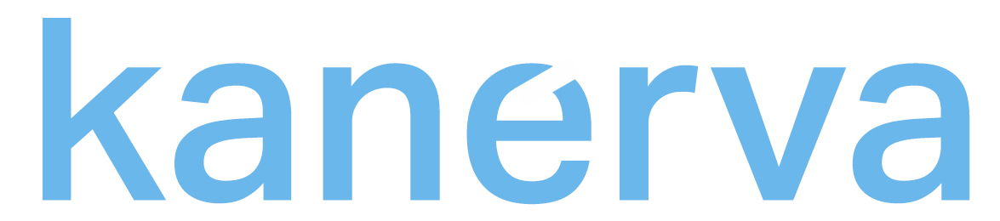

        </img>

 

## Overview
The repository contains the source code for `kanerva` in rust.

### For more information

### Authors
Bela Berde, Ph.D., 
<a href="mailto:bela.berde@nokia-bell-labs.com">bela.berde@nokia-bell-labs.com</a>

<footer><small>&copy; Copyright 2018</small></footer>
